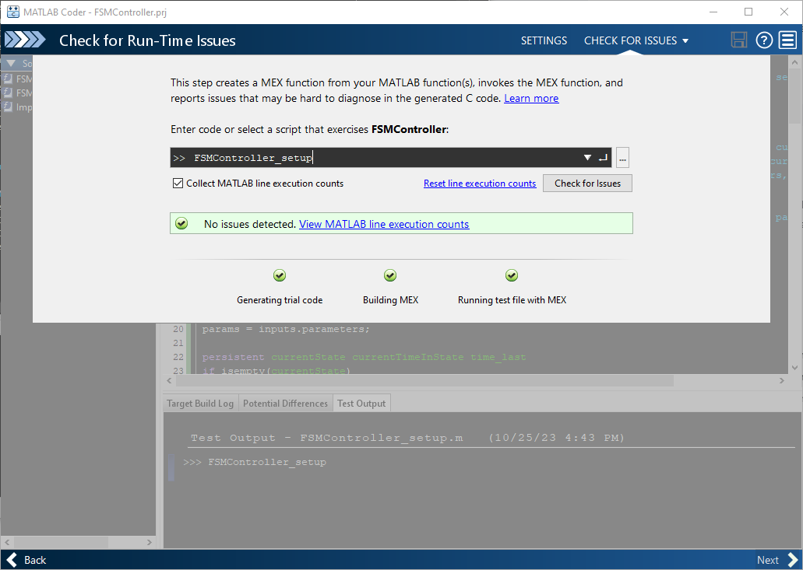

# Finite State Machine Controller - MATLAB Implementation
This section of the repository contains the source code for the MATLAB implementation of the Finite State Machine Walking Controller. The first subsection details the source files and how we implemented the finite state machine logic in MATLAB. If you're comfortable with writing object-oriented MATLAB code, you can skip down to the [Code Generation and Compilation Section](#code-generation-and-compilation).

## Prerequisites
- MATLAB (any somewhat recent version will do)
- [MATLAB Coder](https://www.mathworks.com/products/matlab-coder.html)
- [MATLAB Raspberry Pi Hardware Support Package](https://www.mathworks.com/hardware-support/raspberry-pi-matlab.html)

> **_NOTE_**: MATLAB Coder and the Hardware Support Package can be installed using the `Add-On Explorer` in MATLAB.

## Source Files
The source files consist of a main function `FSMController.m`, a setup script `FSMController_setup.m`, and a `Type Definitions` directory. The main function `FSMController.m` is what our OSL code will call each time through the control loop to execute the state machine logic and calculate knee and ankle impedance values. The setup script is used to configure the search path and to define the function's input and output variables for code generation (see below). 

### Type Definitions
To define input and output types similar to how one would define them in `C` or `C++`, we utilize MATLAB classes. To define a new class, make a new file containing the class name, a properties block, and a single constructor method. For example, we define the `ImpedanceParameters` class as

```
classdef ImpedanceParameters
    properties
        stiffness
        damping
        eqAngle
    end
    methods
        function obj = ImpedanceParameters()
            obj.stiffness = 0;
            obj.damping = 0;
            obj.eqAngle = 0; 
        end
    end           
end
```

In the properties block of this file, we define that the `ImpedanceParameters` structure has three fields, `stiffness`, `damping`, and `eqAngle`. Next in the `methods` block, we create a constructor that initializes each field to a value. Since we don't specify a data type, MATLAB assumes that they are `doubles`. 

> **_NOTE:_** The constructor is simply a method with the same name as the class that returns `obj`. If you are unfamiliar with object oriented programming in MATLAB and Class syntax, check out the simple class definition and explanation on the [MathWorks Help Center](https://www.mathworks.com/help/matlab/matlab_oop/user-defined-classes.html). 

We then make another class called `JointImpedanceSet` that contains four `ImpedanceParameter` objects, one for each state in the state machine.

```
classdef JointImpedanceSet
    properties
        earlyStance ImpedanceParameters
        lateStance ImpedanceParameters
        earlySwing ImpedanceParameters
        lateSwing ImpedanceParameters
    end
    methods
        function obj = JointImpedanceSet()
            obj.earlyStance = ImpedanceParameters();
            obj.lateStance = ImpedanceParameters();
            obj.earlySwing = ImpedanceParameters();
            obj.lateSwing = ImpedanceParameters();
        end
    end
end
```

Likewise, we create a `TransitionParameters` class to hold all of the state machine's transition parameters and a `Sensors` class to hold the sensor data. 

```
classdef TransitionParameters
    properties
        minTimeInState = 0.0;
        loadLStance (1,1) double = 0;
        ankleThetaEStanceToLStance (1,1) double = 0;
        kneeThetaESwingToLSwing (1,1) double = 0;
        kneeDThetaESwingToLSwing (1,1) double = 0;
        loadESwing (1,1) double = 0;
        loadEStance (1,1) double = 0;
        kneeThetaLSwingToEStance (1,1) = 0;
    end
end
```

```
<details>
<summary>
    Sensors.m
    </summary>
classdef Sensors
    properties
        kneeAngle
        ankleAngle
        kneeVelocity
        ankleVelocity
        Fz
    end
    methods 
        function obj = Sensors()
            obj.kneeAngle = 0.0;
            obj.ankleAngle = 0.0;
            obj.kneeVelocity = 0.0;
            obj.ankleVelocity = 0.0; 
            obj.Fz = 0.0; 
        end
    end
end
```
</details>

Finally, we define our `FSM_Inputs` type using the types we just defined. 

https://github.com/neurobionics/OSL_CompiledControllers_Source/blob/97973ee80d8a63ef02bea106b8a8064f2c2b013e/Finite%20State%20Machine%20Walking%20Controller/Matlab/Type%20Definitions/FSM_Inputs.m#L1-L14

So far, all the types that we have defined have been `doubles`. Next we're going to define an enumeration for the active state name called `eStates`. 

https://github.com/neurobionics/OSL_CompiledControllers_Source/blob/97973ee80d8a63ef02bea106b8a8064f2c2b013e/Finite%20State%20Machine%20Walking%20Controller/Matlab/Type%20Definitions/eStates.m#L1-L8

We tell this class to inheret (via the `< int32` command) from the integer class, as C++ represents enumerations as integers and we want the MATLAB implementation to be interchangable with the C++ representation in terms of inputs and outputs.

> **_NOTE:_** For more details on enumeration classes in MATALB, please see this [help page](https://www.mathworks.com/help/matlab/matlab_oop/enumerations.html).

Finally, we define the output type `FSM_Outputs` to contain the active impedance parameters for both joints, the time elapsed in the current state, and the enum of the current state.

https://github.com/neurobionics/OSL_CompiledControllers_Source/blob/97973ee80d8a63ef02bea106b8a8064f2c2b013e/Finite%20State%20Machine%20Walking%20Controller/Matlab/Type%20Definitions/FSM_Outputs.m#L1-L16

### Main Function
The main function `[outputs] = FSMController(inputs)` takes inputs of the `FSM_Inputs.m` type and returns a structure of the `FSM_Outputs.m` type. In the first few lines of the file, we unpack things from the inputs structure for convenience and we declare persistent variables. Persistent variables are used in MATLAB to retian data from one function call to the next, similar to `static` in `C` (see [Mathworks Help Center](https://www.mathworks.com/help/matlab/ref/persistent.html)). We want to keep track of which state we're in, as well as how long we've been there, so we declare these inputs:
```matlab
% Unpack things for convenience 
sensors = inputs.sensors;
params = inputs.parameters;

persistent currentState currentTimeInState time_last
if isempty(currentState)
    currentState = eStates.eStance;
    currentTimeInState = 0;
    time_last = inputs.time;
end
```

Next we have our main state machine logic. Each branch of the `if` statement checks the transition parameters to exit each state. 
```matlab
% Finite State Machine
if currentState == eStates.eStance
    if(sensors.Fz < params.transitionParameters.loadLStance ...
            && sensors.ankleAngle > ...
            params.transitionParameters.ankleThetaEStanceToLStance ...
            && currentTimeInState > params.transitionParameters.minTimeInState)
        currentState = eStates.lStance;
        currentTimeInState = 0.0;
    else
        currentState = eStates.eStance;
        currentTimeInState = currentTimeInState + dt;
    end

elseif currentState == eStates.lStance
    if(sensors.Fz > params.transitionParameters.loadESwing && ...
            currentTimeInState > params.transitionParameters.minTimeInState)
        currentState = eStates.eSwing;
        currentTimeInState = 0.0;
    else
        currentState = eStates.lStance;
        currentTimeInState = currentTimeInState + dt;
    end

elseif currentState == eStates.eSwing
    if (sensors.kneeAngle > params.transitionParameters.kneeThetaESwingToLSwing ...
            && sensors.kneeVelocity < params.transitionParameters.kneeDThetaESwingToLSwing ...
            && currentTimeInState > params.transitionParameters.minTimeInState)

        currentState = eStates.lSwing;
        currentTimeInState = 0.0;

    else
        currentState = eStates.eSwing;
        currentTimeInState = currentTimeInState + dt;

    end

elseif currentState == eStates.lSwing

    if ((sensors.Fz < params.transitionParameters.loadEStance ...
            || sensors.kneeAngle < params.transitionParameters.kneeThetaLSwingToEStance) ...
            && currentTimeInState > params.transitionParameters.minTimeInState)
        currentState = eStates.eStance;
        currentTimeInState = 0.0;
    else
        currentState = eStates.lSwing;
        currentTimeInState = currentTimeInState + dt;

    end

else
    currentState = eStates.eStance;
    currentTimeInState = currentTimeInState + dt;
end
```

Finally, we choose between sets of impedance parameters based on the current states and write to the outputs structure. 

```matlab
% Select impedance parameters based on the current state
switch currentState
    case eStates.eStance
        kneeImpedance = params.kneeImpedance.earlyStance;
        ankleImpedance = params.ankleImpedance.earlyStance;
    case eStates.lStance
        kneeImpedance = params.kneeImpedance.lateStance;
        ankleImpedance = params.ankleImpedance.lateStance;
    case eStates.eSwing
        kneeImpedance = params.kneeImpedance.earlySwing;
        ankleImpedance = params.ankleImpedance.earlySwing;
    case eStates.lSwing
        kneeImpedance = params.kneeImpedance.lateSwing;
        ankleImpedance = params.ankleImpedance.lateSwing;
    otherwise
        kneeImpedance = params.kneeImpedance.earlyStance;
        ankleImpedance = params.ankleImpedance.earlyStance;
end

% Write to output structures

outputs = FSM_Outputs();
outputs.currentState = currentState;
outputs.timeInCurrentState = currentTimeInState;
outputs.kneeImpedance = kneeImpedance;
outputs.ankleImpedance = ankleImpedance;
```

### Setup Script
The purpose of the setup script is to configure the MATLAB path and to make a test call to the main function. In this case, our setup file is quite simple. We reset the workspace, add the `Type Defintions` directory to the path, and call the main function once. 
```matlab
clear all
close all

addpath("Type Definitions")
inputs = FSM_Inputs();

outputs = FSMController(inputs);
```

And that is all of the source files. Now we'll move on to using MATLAB Coder and generating the shared object library. 
## Code Generation and Compilation
We will use [MATLAB Coder](https://www.mathworks.com/products/matlab-coder.html) to convert the function `FSMController.m` into `C` and then compile it into a shared object library for the Raspberry Pi. After ensuring all [prerequisites are installed](#prerequisites), perform the following steps in MATLAB with the working directory set to ``...\OSL_CompiledControllers_Source\Finite State Machine Walking Controller\Matlab``. 

### Using MATLAB Coder
1. Type `coder` into the command window and press enter. 
2. Enter `FSMController` for the function name to install and press enter. Your screen should look like this:
3. In the next page, type `FSMController_setup` into the field and press `Autodefine Input Types`. MATLAB will then call this script to figure out the structure of the functions inputs and outputs. If successful, your screen will look like this the following. Then click next.

4. The next page is the `Check for Issues` page. You can click the `Check for Issues` button to ensure no odd behavior in the generated code. 

5. The next page is the code generation page. Set the Build type to be a `Dynamic Library` and select `Raspberry Pi` as the Hardware Board. 

6. Click on `More Settings` and navigate to the `Hardware` tab. Enter the IP address and credentials for your Raspberry Pi. Note that in order to compile the shared object, your PC and Pi must both be on the same network. Click `Close` and then click `Generate`.

7. You should get a message that code generation was successful. You can now copy the generated library `FSMController.so` to wherever you want to use it. You'll find it in the specified `Build Directory` (configured right below the login credentials) on the Pi. 

### Checking the Resulting `C` Code
MATLAB Coder makes fairly readable `C` code. We can examine the generated code to confirm that it will work with the `opensourceleg` library's `CompiledControl` module. Inside the generated file `FSMController.h`, we see that the `FSMController` function has the appropriate interface:
```c
/* Function Declarations */
extern void FSMController(const FSM_Inputs *inputs, FSM_Outputs *outputs);
```
Likewise, we see in `FSMController_types.h` that our structures were also appropriately defined, paralleling our class definition: 
```c
/*
 * Academic License - for use in teaching, academic research, and meeting
 * course requirements at degree granting institutions only.  Not for
 * government, commercial, or other organizational use.
 * File: FSMController_types.h
 *
 * MATLAB Coder version            : 5.6
 * C/C++ source code generated on  : 25-Oct-2023 16:52:20
 */

#ifndef FSMCONTROLLER_TYPES_H
#define FSMCONTROLLER_TYPES_H

/* Include Files */
#include "rtwtypes.h"

/* Type Definitions */
#ifndef enum_eStates
#define enum_eStates
enum eStates
{
  eStance = 1, /* Default value */
  lStance,
  eSwing,
  lSwing
};
#endif /* enum_eStates */
#ifndef typedef_eStates
#define typedef_eStates
typedef enum eStates eStates;
#endif /* typedef_eStates */

#ifndef typedef_ImpedanceParameters
#define typedef_ImpedanceParameters
typedef struct {
  double stiffness;
  double damping;
  double eqAngle;
} ImpedanceParameters;
#endif /* typedef_ImpedanceParameters */

#ifndef typedef_JointImpedanceSet
#define typedef_JointImpedanceSet
typedef struct {
  ImpedanceParameters earlyStance;
  ImpedanceParameters lateStance;
  ImpedanceParameters earlySwing;
  ImpedanceParameters lateSwing;
} JointImpedanceSet;
#endif /* typedef_JointImpedanceSet */

#ifndef typedef_TransitionParameters
#define typedef_TransitionParameters
typedef struct {
  double minTimeInState;
  double loadLStance;
  double ankleThetaEStanceToLStance;
  double kneeThetaESwingToLSwing;
  double kneeDThetaESwingToLSwing;
  double loadESwing;
  double loadEStance;
  double kneeThetaLSwingToEStance;
} TransitionParameters;
#endif /* typedef_TransitionParameters */

#ifndef typedef_FSMParameters
#define typedef_FSMParameters
typedef struct {
  double bodyWeight;
  JointImpedanceSet kneeImpedance;
  JointImpedanceSet ankleImpedance;
  TransitionParameters transitionParameters;
} FSMParameters;
#endif /* typedef_FSMParameters */

#ifndef typedef_Sensors
#define typedef_Sensors
typedef struct {
  double kneeAngle;
  double ankleAngle;
  double kneeVelocity;
  double ankleVelocity;
  double Fz;
} Sensors;
#endif /* typedef_Sensors */

#ifndef typedef_FSM_Inputs
#define typedef_FSM_Inputs
typedef struct {
  FSMParameters parameters;
  Sensors sensors;
  double time;
} FSM_Inputs;
#endif /* typedef_FSM_Inputs */

#ifndef typedef_FSM_Outputs
#define typedef_FSM_Outputs
typedef struct {
  eStates currentState;
  double timeInCurrentState;
  ImpedanceParameters kneeImpedance;
  ImpedanceParameters ankleImpedance;
} FSM_Outputs;
#endif /* typedef_FSM_Outputs */

#endif
/*
 * File trailer for FSMController_types.h
 *
 * [EOF]
 */
```

## Next Steps
You've now successfully generated the shared object library for the MATLAB implementation of the Finite State Machine Walking Controller. This compiled library is now ready to use with the `opensourceleg`. 
Head over to the `opensourceleg` repository to find the [example code](https://github.com/neurobionics/opensourceleg/blob/main/examples/fsm_walking_compiled_controller.py) that can use this compiled library.
For help using the library once you've made it, see the [`opensourceleg` library documentation](https://opensourceleg.readthedocs.io/en/latest/examples/compiled_control.html).
